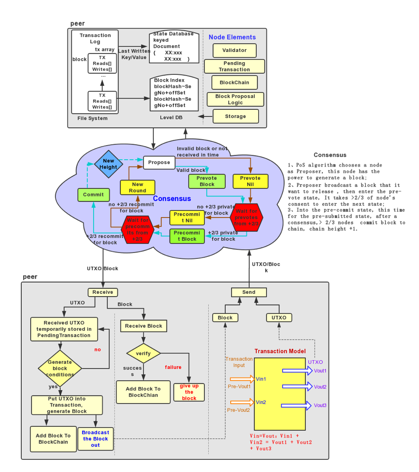
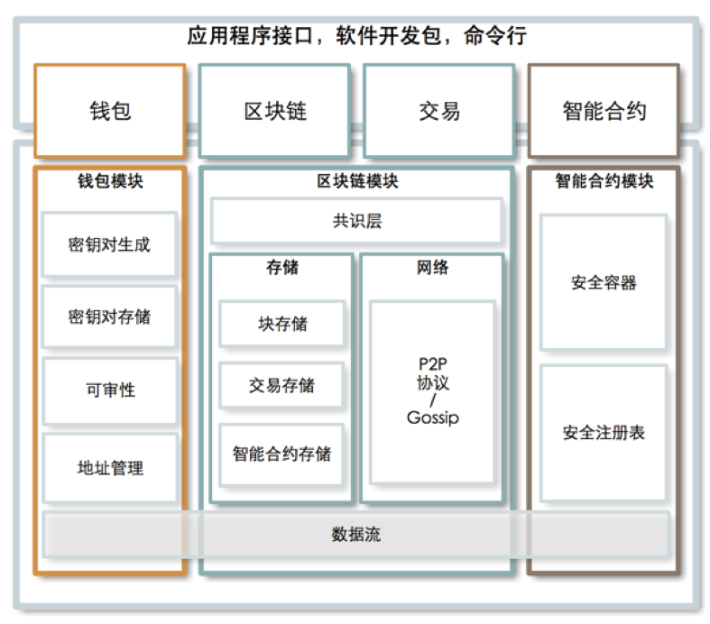
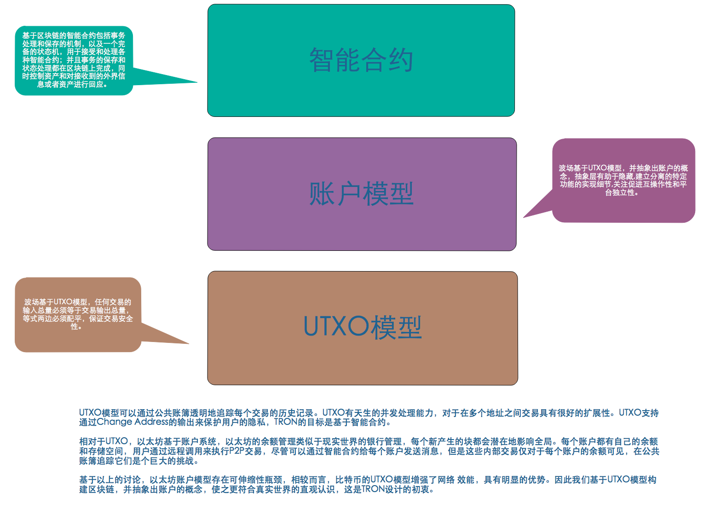
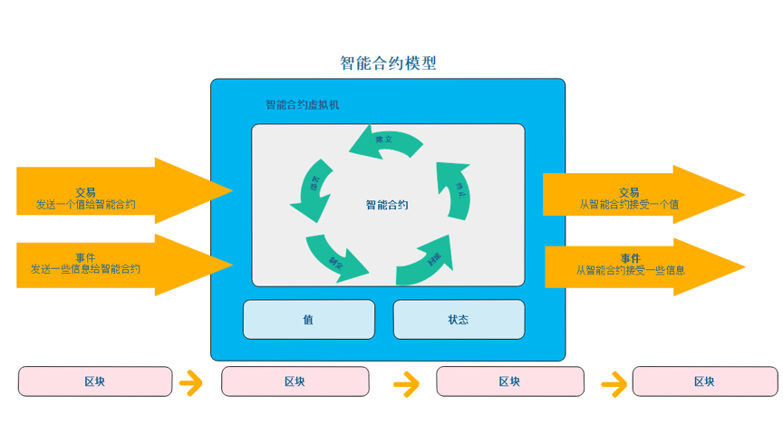
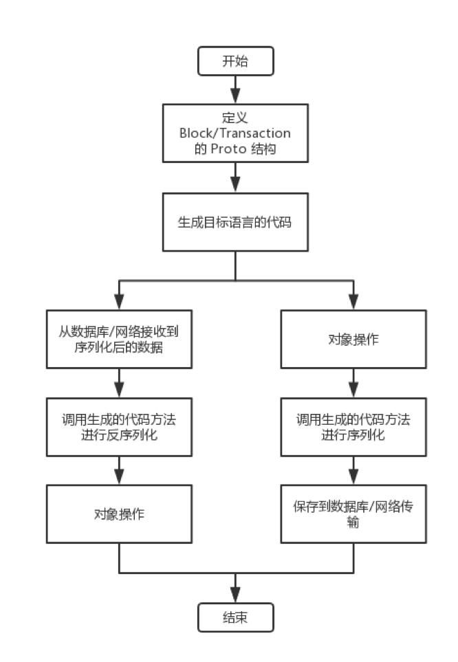

# TRON 简介


## 一 简介
TRON包含共识引擎、ABCI、UTXO、智能合约等模块。共识引擎是其核心，应用通过ABCI与之对接，实现为拜占庭容错的状态机，可以由任意一种编程语言实现。
TRON区块链平台具有以下特点：

- 可扩展性：TRON区块链可通过侧链扩容，意味着不仅货币交易，具有法律约束能力的合同及证书、音频视频文件都可储存在区块链的数据库上；
- 去中心化：没有中介机构，所有节点的权利和义务都相等，任一节点停止工作都不会影响系统整体的运作；
- 非可信环境：系统中所有节点之间无需信任也可以进行交易因为数据库和整个系统的运作是公开透明的，节点之间无法欺骗彼此；
- 一致性：节点之间的数据信息是一致的；
- 容错型：系统能包容1/3节点的拜占庭故障；
- 扩展性账户模型：UTXO模型 + Account抽象。TRON在采用了UTXO易于并行运算的模型前提下，还做了针对性的改进；为了数据易于管理，易于编程，TRON引入世界状态—轻量级状态树的概念，每一种资产都维持一个全局世界状态，该全局状态具有快速可查找，不可更改，简单易提供证明的特性。

## 二 软件层次图


软件层次分为两大部分。第一部分为应用程序接口，软件开发包和命令行，主要为外部提供程序调用接口，方便开发；第二部分为模块，包括钱包模块，区块链模块和智能合约模块，同时提供了存储接口，方便各个模块的数据持久化。

## 三 UTXO


UTXO模型可以通过公共账簿透明地追踪每个交易的历史记录。UTXO有天生的并发处理能力，对于在多个地址之间交易具有很好的扩展性。UTXO支持通过Change Address的输出来保护用户的隐私，TRON的目标是基于智能合约。

相对于UTXO，以太坊基于账户系统，以太坊的余额管理类似于现实世界的银行管理，每个新产生的块都会潜在地影响全局。每个账户都有自己的余额和存储空间，用户通过远程调用来执行P2P交易，尽管可以通过智能合约给每个账户发送消息，但是这些内部交易仅对于每个账户的余额可见，在公共账簿追踪它们是个巨大的挑战。

基于以上的讨论，以太坊账户模型存在可伸缩性瓶颈，相较而言，比特币的UTXO模型增强了网络 效能，具有明显的优势。因此我们基于UTXO模型构建区块链，并抽象出账户的概念，使之更符合真实世界的直观认识，这是TRON设计的初衷。

## 四 智能合约


确定性和可终止性是智能合约的两种性质，在设计智能合约系统的时候，需要想办法把非确定性因素排除在外。

比特币内置了一套脚本引擎，其指令集非常简单且非图灵完备，具有可终止性，因此比特币的智能合约是确定性的。以太坊虚拟机（EVM）是以太坊中智能合约的运行环境，以太坊智能合约的系统函数不是非确定性的，但是合约的调用路径会是非确定性的，会导致一个可扩展性上的重要性能损失，它采用计价器实现可终止性。Hyperledger Fabric智能合约采用了Docker作为执行环境。Docker是轻量级的虚拟化技术，在区块链下Docker是一个比较“重”的执行环境，这也是Fabric的性能瓶颈所在，目前只能达到每秒几百TPS，它采用计时器实现可终止性。

为了兼顾确定性，可终止性以及虚拟机的轻量级和容器方案的编写语言灵活性这些优点，TRON准备在未来开发轻量级的 TVM（Tron Virtual Machine）作为其智能合约的执行环境，它的启动速度非常快，占用资源也很小。TRON虚拟机的数据操作指令直接对数组及复杂数据结构提供支持。这些都会提升 TRON智能合约的运行性能。TRON网络计划对代币转账和智能合约的运行和存储进行收费，从而实现对记账人的经济激励和防止资源滥用。

未来TRON智能合约开发者可以直接使用几乎任何他们擅长的高级语言来进行 TRON智能合约的开发工作。首批计划支持的语言是 java ，Go等。TRON计划提供这些语言的编译器和插件，用于将高级语言编译成 TRON虚拟机所支持的指令集。

如上图所示是TRON的智能合约模型：一段代码（智能合约），运行在智能合约虚拟机上，被部署在分享的、复制的账本（区块链）上，TRON对智能合约进行了生命周期的管理, 分别是：建立，部署，制定，回滚，终止。它可以维持自己的状态，控制自己的资产值和接收到外界信息、交易或者对外界信息、交易进行回应。

## 五 共识

TRON的共识采取分三步走的策略，第一步采用基于Kafka的技术体制，实现中心化共识算法，目的在于实现系统的联调联试，功能集成；第二步采用基于Raft的分布式共识机制，实现了从中心化到分布式的跨越，这一步逐渐完善网络、分发等功能，为最终实现无逻辑中心的广域全分布打下基础；第三步实现PoS的共识机制，实现基于 “保证金机制 + epoch确认”的拜占庭容错共识，同时兼容PoS和PoW的集成共识。目前TRON的开源代码实现了第一阶段的中心共识算法。第二阶段的分布式共识算法正在开发测试中。

## 六 基于Protocol Buffer的对象编码和序列化



### 实例
**Proto代码**

```
message Block {
    repeated Transaction transactions = 1;
    BlockHeader blockHeader = 2;
}
```

**序列化**

```
Block.Builder block = Block.newBuilder()
    .setTransactions(transactions)
    .setBlockHeader(blockHeader)
    .build();
    
byte[] blockData = block.toByteArray();
byte[] keyData = block.getHash();
DB.saveBlock(keyData, blockData);
```

**反序列化**

```
byte[] keyData = block.getHash();
byte[] blockData = DB.getBlock(keyData);
Block block = Block.parseFrom(blockData).toBuilder().build();
```

